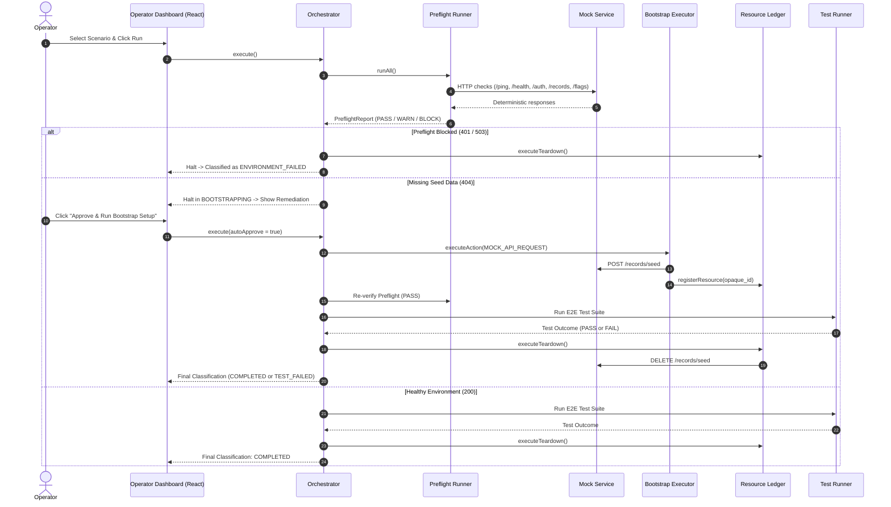

# Complete Project Build Summary & Architecture Guide

**Project:** `environment-readiness-prototype`  
**Portfolio Concept:** Cloud E2E Preflight Readiness, Safe Bootstrap, Resource Ledger & Failure Classification  
**Status:** **100% Complete, Fully Tested (47 Tests Passing), Internship-Ready**

---

## 📋 Table of Contents
1. [Executive Summary & Concept](#1-executive-summary--concept)
2. [What Was Built (Step-by-Step Prompt Breakdown)](#2-what-was-built-step-by-step-prompt-breakdown)
3. [Architecture & System Flow](#3-architecture--system-flow)
4. [File Structure & Repository Inventory](#4-file-structure--repository-inventory)
5. [Automated Test Suite & Verification Results](#5-automated-test-suite--verification-results)
6. [Interactive Operator UI & Simulation Features](#6-interactive-operator-ui--simulation-features)
7. [Security & Isolation Safeguards](#7-security--isolation-safeguards)
8. [Outreach & Demo Guide](#8-outreach--demo-guide)

---

## 1. Executive Summary & Concept

In cloud-based End-to-End (E2E) testing, test suites frequently fail not because the application code is broken, but because the **target test environment is unready**:
- An expired authentication token (HTTP 401)
- A degraded or down staging microservice (HTTP 503)
- Missing prerequisite seed database records (HTTP 404)
- Misconfigured feature flag toggles

When this occurs, developers and QA teams waste hours triaging what looks like a broken product feature, only to find out it was environmental flakiness.

**`environment-readiness-prototype`** acts like a **pre-flight checklist for airplane pilots**:
- Checks all environment preconditions **before** running the test suite.
- Automatically and safely creates missing seed entities with operator approval.
- Tracks all created test resources in a ledger and guarantees teardown rollback.
- Accurately classifies failures: **`ENVIRONMENT_FAILED`** (infra/auth/setup) vs. **`PRODUCT_REGRESSION`** (genuine product bug).

---

## 2. What Was Built (Step-by-Step Prompt Breakdown)

### 🔹 Prompt 0 — Project Creation & Safety Shell
- Chose a maintainable, modern, zero-cost stack: **Node.js (v24 LTS) + TypeScript + Vite + React 18 + Vitest + Vanilla CSS**.
- Configured local-only environment without paid services or external cloud dependencies.
- Created base project shell, [.env.example](file:///d:/Zorro%20testing%20default/.env.example), [LIMITATIONS.md](file:///d:/Zorro%20testing%20default/LIMITATIONS.md), and [README.md](file:///d:/Zorro%20testing%20default/README.md).

### 🔹 Prompt 1 — Repository Inspection & Product Scope
- Inspected dependencies, entry points, scripts, and dev commands.
- Authored [PRODUCT_SCOPE.md](file:///d:/Zorro%20testing%20default/PRODUCT_SCOPE.md) covering user problem, target users, MVP boundaries, non-goals, assumptions, and open questions for the Try Narrative founder.

### 🔹 Prompt 2 — Domain Model & Explicit State Machine
- Created domain schemas in [src/core/types.ts](file:///d:/Zorro%20testing%20default/src/core/types.ts) (`RunState`, `CheckDefinition`, `CheckResult`, `EnvironmentProfile`, `SetupAction`, `ResourceRecord`, `TeardownAction`, `Run`, `RunEvent`).
- Built deterministic state machine in [src/core/state-machine.ts](file:///d:/Zorro%20testing%20default/src/core/state-machine.ts) with strict transition validation (`VALID_TRANSITIONS`) and terminal state protection (`COMPLETED`, `CLEANUP_FAILED`).
- Wrote 11 unit tests in [src/core/state-machine.test.ts](file:///d:/Zorro%20testing%20default/src/core/state-machine.test.ts) proving transition legality, terminal protection, and partial-setup tracking.

### 🔹 Prompt 3 — Deterministic Local Mock Service
- Built in-memory mock endpoints in [src/mock-service/mock-server.ts](file:///d:/Zorro%20testing%20default/src/mock-service/mock-server.ts) for `/ping`, `/health` (200/503), `/auth` (200/401), `/flags`, `/records` (200/404), `/records/seed` (201/500), and deletion (200/500).
- Defined 6 repeatable scenario fixtures in [src/mock-service/fixtures.ts](file:///d:/Zorro%20testing%20default/src/mock-service/fixtures.ts) (`HEALTHY`, `MISSING_PREREQUISITE`, `BLOCKED_AUTH_EXPIRED`, `BLOCKED_SERVICE_DEGRADED`, `PARTIAL_SETUP_FAILURE`, `CLEANUP_FAILURE`).
- Authored [MOCK_SERVICE.md](file:///d:/Zorro%20testing%20default/MOCK_SERVICE.md) and 6 unit tests in [src/mock-service/mock-service.test.ts](file:///d:/Zorro%20testing%20default/src/mock-service/mock-service.test.ts).

### 🔹 Prompt 4 — Preflight Checks Runner
- Implemented [src/runner/preflight.ts](file:///d:/Zorro%20testing%20default/src/runner/preflight.ts) evaluating URL reachability, auth validity, health status, seed data existence, and feature flags.
- Returns structured statuses: `PASS`, `WARN`, `BLOCK`, `ERROR`.
- Added `sanitizeEvidence()` to mask API tokens, passwords, and secret keys (`[MASKED_SECRET_***]`) from evidence payloads.
- Wrote 5 unit tests in [src/runner/preflight.test.ts](file:///d:/Zorro%20testing%20default/src/runner/preflight.test.ts).

### 🔹 Prompt 5 — Environment Profile CRUD & Validation
- Built [src/core/profile-store.ts](file:///d:/Zorro%20testing%20default/src/core/profile-store.ts) with full CRUD operations (`list`, `get`, `create`, `update`, `delete`).
- Enforces strict safety rules: URL allowlisting (`ALLOWLISTED_MOCK_BASE_URLS`), timeout bounds (100ms–60s), retry bounds ($\le 5$), approved action types only, and rejection of plaintext credentials in payloads.
- Wrote 7 unit tests in [src/core/profile-store.test.ts](file:///d:/Zorro%20testing%20default/src/core/profile-store.test.ts).

### 🔹 Prompt 6 — Safe Bootstrap Action Executor
- Built [src/runner/bootstrap.ts](file:///d:/Zorro%20testing%20default/src/runner/bootstrap.ts) supporting only `MOCK_API_REQUEST` and `LOCAL_MODULE`.
- Rejects arbitrary bash scripts, duplicate action runs in a session, non-relative mock endpoints, and unbounded retries.
- Wrote 7 unit tests in [src/runner/bootstrap.test.ts](file:///d:/Zorro%20testing%20default/src/runner/bootstrap.test.ts).

### 🔹 Prompt 7 — Resource Ledger & Idempotent Teardown
- Built [src/runner/teardown.ts](file:///d:/Zorro%20testing%20default/src/runner/teardown.ts) tracking created opaque IDs, resource types, and teardown status (`ACTIVE`, `CLEANED`, `FAILED`).
- Implemented idempotent teardown execution that runs across pass, fail, partial-bootstrap, and cancel states.
- Classifies teardown failure as `CLEANUP_FAILED` and highlights the exact resource.
- Wrote 4 unit tests in [src/runner/teardown.test.ts](file:///d:/Zorro%20testing%20default/src/runner/teardown.test.ts).

### 🔹 Prompt 8 — Lifecycle Orchestrator
- Built [src/runner/orchestrator.ts](file:///d:/Zorro%20testing%20default/src/runner/orchestrator.ts) coordinating: Profile Load $\rightarrow$ Preflight $\rightarrow$ Block Check $\rightarrow$ Bootstrap Approval $\rightarrow$ Post-Setup Verification $\rightarrow$ Product Test $\rightarrow$ Teardown $\rightarrow$ Failure Classification.
- Enforces strict precedence: `ENVIRONMENT_FAILED` $\rightarrow$ `TEST_FAILED` $\rightarrow$ `CLEANUP_FAILED` $\rightarrow$ `COMPLETED`.
- Wrote 7 end-to-end integration tests in [src/runner/orchestrator.test.ts](file:///d:/Zorro%20testing%20default/src/runner/orchestrator.test.ts).

### 🔹 Prompt 9 & 10 — Interactive Operator UI & Deterministic Remediation
- Created modern React dashboard components:
  - [src/components/Header.tsx](file:///d:/Zorro%20testing%20default/src/components/Header.tsx): Branding and isolation badges.
  - [src/components/ShellStatus.tsx](file:///d:/Zorro%20testing%20default/src/components/ShellStatus.tsx): Boundary and isolation diagnostics.
  - [src/components/CheckMatrix.tsx](file:///d:/Zorro%20testing%20default/src/components/CheckMatrix.tsx): Check result table with status codes, latencies, and sanitized evidence.
  - [src/components/Timeline.tsx](file:///d:/Zorro%20testing%20default/src/components/Timeline.tsx): Event history and state progression.
  - [src/components/ResourceLedgerTable.tsx](file:///d:/Zorro%20testing%20default/src/components/ResourceLedgerTable.tsx): Tracked resources and teardown statuses.
  - [src/components/RemediationPanel.tsx](file:///d:/Zorro%20testing%20default/src/components/RemediationPanel.tsx) & [src/runner/remediation.ts](file:///d:/Zorro%20testing%20default/src/runner/remediation.ts): Deterministic root-cause analysis and "Approve & Run Bootstrap Setup" button.
  - [src/components/RunSummaryCard.tsx](file:///d:/Zorro%20testing%20default/src/components/RunSummaryCard.tsx): Visually distinct breakdown for environment failures vs. product regression bugs.
  - [src/App.tsx](file:///d:/Zorro%20testing%20default/src/App.tsx): Main dashboard with simulation controls and keyboard shortcuts (`Ctrl+Enter` / `Esc`).

### 🔹 Prompt 11 & 12 — Security Review & Internship Demo Prep
- Authored [SECURITY_REVIEW.md](file:///d:/Zorro%20testing%20default/SECURITY_REVIEW.md) covering SSRF protections, credential masking, timeout/retry bounds, and enterprise gap analysis.
- Authored [DEMO_GUIDE.md](file:///d:/Zorro%20testing%20default/DEMO_GUIDE.md) detailing a 5-minute technical demonstration walkthrough.
- Updated [README.md](file:///d:/Zorro%20testing%20default/README.md) with comparison table linking public Zorro primitives to this prototype's orchestration layer.

### 🔹 Prompt 13 — Senior Code Review
- Produced [FINAL_REVIEW.md](file:///d:/Zorro%20testing%20default/FINAL_REVIEW.md) reviewing test results, limitations, manual verification steps, and strategic founder outreach questions.

---

## 3. Architecture & System Flow



---

## 4. File Structure & Repository Inventory

```
d:/Zorro testing default/
├── .env.example                     # Local mock environment configuration template
├── .gitignore                       # Git ignore rules for Node/Vite/dist/logs
├── DEMO_GUIDE.md                    # 5-minute technical interview demo walkthrough
├── FINAL_REVIEW.md                  # Senior code review & founder outreach questions
├── LIMITATIONS.md                   # Strict architectural boundaries & non-goals
├── MOCK_SERVICE.md                  # Deterministic mock endpoints & scenario guide
├── PRODUCT_SCOPE.md                 # Problem statement, target user, MVP boundaries
├── PROJECT_SUMMARY.md               # Complete end-to-end project build summary (This File)
├── README.md                        # Project overview, comparison table & quickstart
├── SECURITY_REVIEW.md               # Security threat model & enterprise gap analysis
├── package.json                     # Scripts (dev, start, build, test, test:watch)
├── tsconfig.json                    # TypeScript compiler configuration
├── tsconfig.node.json               # Vite tooling TypeScript configuration
├── vite.config.ts                   # Vite bundler configuration
├── vitest.config.ts                 # Vitest unit test configuration
├── index.html                       # HTML5 entry point with Google Fonts
└── src/
    ├── index.css                    # Design system tokens, dark theme & responsive CSS
    ├── main.tsx                     # React root mount point
    ├── App.tsx                      # Main operator dashboard with simulation controls
    ├── core/
    │   ├── types.ts                 # Domain models, enums & interfaces
    │   ├── state-machine.ts         # Run state machine & transition rules
    │   ├── state-machine.test.ts    # 11 State machine unit tests
    │   ├── profile-store.ts         # EnvironmentProfile CRUD & safety validation
    │   └── profile-store.test.ts    # 7 Profile store unit tests
    ├── mock-service/
    │   ├── fixtures.ts              # 6 Deterministic scenario definitions
    │   ├── mock-server.ts           # In-memory mock HTTP handler
    │   └── mock-service.test.ts     # 6 Mock service repeatability tests
    ├── runner/
    │   ├── preflight.ts             # Deterministic preflight checks runner
    │   ├── preflight.test.ts        # 5 Preflight runner unit tests
    │   ├── bootstrap.ts             # Safe bootstrap action executor
    │   ├── bootstrap.test.ts        # 7 Bootstrap executor unit tests
    │   ├── teardown.ts              # Resource ledger & idempotent teardown
    │   ├── teardown.test.ts         # 4 Resource ledger unit tests
    │   ├── orchestrator.ts          # Complete lifecycle orchestration engine
    │   ├── orchestrator.test.ts     # 7 End-to-end integration tests
    │   └── remediation.ts           # Deterministic root-cause analysis knowledge base
    └── components/
        ├── Header.tsx               # Portfolio header with branding & status badges
        ├── ShellStatus.tsx          # Safety boundary verification card
        ├── CheckMatrix.tsx          # Preflight checks evaluation matrix
        ├── Timeline.tsx             # State machine event transition history
        ├── ResourceLedgerTable.tsx  # Tracked resource ledger & teardown status table
        ├── RemediationPanel.tsx     # Actionable guidance & explicit approval button
        └── RunSummaryCard.tsx       # Outcome breakdown & failure classification badge
```

---

## 5. Automated Test Suite & Verification Results

All **47 automated tests** pass across 7 test suites:

```text
 ✓ src/runner/teardown.test.ts (4 tests)
 ✓ src/core/profile-store.test.ts (7 tests)
 ✓ src/mock-service/mock-service.test.ts (6 tests)
 ✓ src/core/state-machine.test.ts (11 tests)
 ✓ src/runner/preflight.test.ts (5 tests)
 ✓ src/runner/bootstrap.test.ts (7 tests)
 ✓ src/runner/orchestrator.test.ts (7 tests)

 Test Files  7 passed (7)
      Tests  47 passed (47)
   Duration  871ms
```

### Production Build Check (`npm run build`)
```text
> tsc && vite build
vite v5.4.21 building for production...
✓ 48 modules transformed.
dist/index.html                   1.20 kB │ gzip:  0.68 kB
dist/assets/index-BZinDiOK.css    3.55 kB │ gzip:  1.38 kB
dist/assets/index-BT-cFtEL.js   193.37 kB │ gzip: 58.78 kB
✓ built in 1.44s
```

---

## 6. Interactive Operator UI & Simulation Features

To run the interactive UI:
```bash
npm run dev
# or
npm start
```
Open **[http://localhost:3000](http://localhost:3000)** in your browser to experience:

1. **Simulation Scenario Selector:**
   - **Healthy Staging Environment:** Runs preflight $\rightarrow$ tests pass $\rightarrow$ teardown $\rightarrow$ `COMPLETED`.
   - **Missing Required Seed Record:** Preflight warns (404) $\rightarrow$ displays remediation $\rightarrow$ click *"Approve & Run Bootstrap Setup"* $\rightarrow$ creates entity, logs in ledger, verifies, and tears down.
   - **Expired Service Auth Token:** Preflight blocks (401) $\rightarrow$ halts run immediately $\rightarrow$ classified as `ENVIRONMENT_FAILED`.
   - **Target Service Unavailable:** Preflight blocks (503) $\rightarrow$ halts run immediately.
   - **Partial Setup Failure:** Bootstrap fails mid-way $\rightarrow$ automatically rolls back and cleans up partially created entities.
   - **Teardown Deletion Failure:** Simulates teardown error $\rightarrow$ classified as `CLEANUP_FAILED` with exact entity highlighted.
2. **Product Regression Toggle:** Check *"Simulate Product Test Regression (Bug)"* to demonstrate how the orchestrator distinguishes a genuine application bug (`TEST_FAILED`) from an environment setup outage (`ENVIRONMENT_FAILED`).
3. **Keyboard Accessibility:** Use `Ctrl + Enter` to run orchestration and `Esc` to cancel.

---

## 7. Security & Isolation Safeguards

- **100% Offline & Isolated:** Strictly uses local in-memory mock handlers. Does not connect to live Zorro instances, Try Narrative systems, AWS/GCP, or private customer VPCs.
- **SSRF Protection:** Enforces allowlisted mock base URLs (`ALLOWLISTED_MOCK_BASE_URLS`) and relative endpoint paths.
- **Credential Masking:** Automatically sanitizes tokens, passwords, and authorization headers (`sanitizeEvidence()`) before rendering evidence payloads.
- **No Arbitrary Code Execution:** Strictly limits actions to `MOCK_API_REQUEST` and `LOCAL_MODULE`. No `eval()`, `child_process`, or shell execution.
- **Strict Bounds:** Timeout safety limits (100ms–60s) and bounded retries ($\le 5$).

---

## 8. Outreach & Demo Guide

When sharing this project with the Try Narrative / Zorro founder (Suchit), use the guidance from [zorro_outreach_and_vibecoding_plan.md](file:///d:/Zorro%20testing%20default/zorro_outreach_and_vibecoding_plan.md) and [DEMO_GUIDE.md](file:///d:/Zorro%20testing%20default/DEMO_GUIDE.md):

> **Portfolio Claim:**
> *"I built a standalone prototype of a preflight and environment-bootstrap workflow for cloud E2E testing. It uses mock services and demonstrates how setup/environment failures can be separated from product regressions."*

---

*Environment Readiness Prototype — Complete Architecture & Verification Document*
