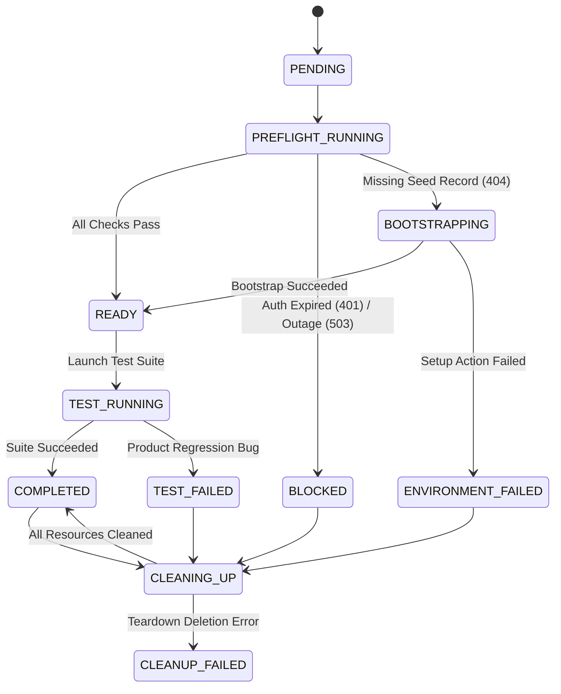

# Environment Readiness Prototype

> **Portfolio Concept Prototype:** A preflight and environment-bootstrap orchestration workflow for cloud E2E testing. It distinguishes environment/setup failures from true product regressions using deterministic mock services.
> 
> *Disclaimer: This is a standalone prototype built with local mock services for portfolio demonstration. It is not connected to, affiliated with, or endorsed by Zorro or Try Narrative.*

---

## 🎯 Concept & Problem Statement

In continuous integration (CI) and cloud-based End-to-End (E2E) testing workflows, test suites frequently fail not due to application code regressions, but because the target test environment is unprepared:
- Expired service-account authentication tokens (HTTP 401)
- Degraded target staging APIs (HTTP 503)
- Missing prerequisite seed data (HTTP 404)
- Misconfigured feature flag toggles

This prototype models a **Preflight & Bootstrap Orchestration Layer** that evaluates environment readiness prior to test execution, runs approved setup actions, tracks all created resources in a ledger, guarantees teardown, and accurately classifies run outcomes.

---

## 🔍 Comparison: Documented Primitives vs. Orchestration Layer

The public Zorro platform exposes robust building blocks for test execution. This prototype demonstrates an orchestration layer that connects these primitives:

| Documented Primitives | What the Primitive Does | Orchestration Layer Added by This Prototype |
| :--- | :--- | :--- |
| **Run-Code Steps** | Executes custom scripting logic within a test step. | Wraps setup/check calls in safe, bounded handlers with retry/timeout safety bounds. |
| **Variables & Environments** | Stores configuration parameters, base URLs, and environment tokens. | Validates allowlisted URLs, enforces timeout boundaries, and prevents plaintext credential storage. |
| **Reusable Modules** | Encapsulates reusable sequences of test steps across suites. | Orchestrates preflight readiness checks as standard pre-run verification suites. |
| **Teardown Modules** | Executes cleanup actions at test conclusion. | Manages a run-scoped **Resource Ledger** that tracks every created entity and guarantees rollback. |
| **Scheduled / CI Triggers** | Launches test suites on schedules or Git webhooks. | Evaluates preflight health *before* triggering full suites, aborting early if the target environment is blocked. |
| **Failure Reporting** | Flags test failure when assertions fail. | **Classifies Root Cause**: Distinguishes `ENVIRONMENT_FAILED` from genuine `PRODUCT_REGRESSION`. |

---

## 🚀 Quickstart & Commands

### Prerequisites
- Node.js (v20+ or v24+)
- npm (v10+)

### 1. Installation
```bash
npm install
```

### 2. Run Automated Test Suite (47+ Tests)
```bash
npm test
```
To run tests in watch mode:
```bash
npm run test:watch
```

### 3. Start Interactive Operator Dashboard
```bash
npm run dev
```
Open [http://localhost:3000](http://localhost:3000) in your browser.

---

## 🔄 State Machine Lifecycle



---

## 📚 Project Documentation

- [PRODUCT_SCOPE.md](file:///d:/Zorro%20testing%20default/PRODUCT_SCOPE.md): Target users, MVP boundaries, non-goals, and open questions.
- [LIMITATIONS.md](file:///d:/Zorro%20testing%20default/LIMITATIONS.md): Strict architectural boundaries and non-production disclaimer.
- [SECURITY_REVIEW.md](file:///d:/Zorro%20testing%20default/SECURITY_REVIEW.md): Threat matrix, SSRF protection, credential sanitization, and safety bounds.
- [MOCK_SERVICE.md](file:///d:/Zorro%20testing%20default/MOCK_SERVICE.md): Deterministic mock endpoints, fixtures, and scenario definitions.
- [DEMO_GUIDE.md](file:///d:/Zorro%20testing%20default/DEMO_GUIDE.md): 5-minute technical demonstration script.
