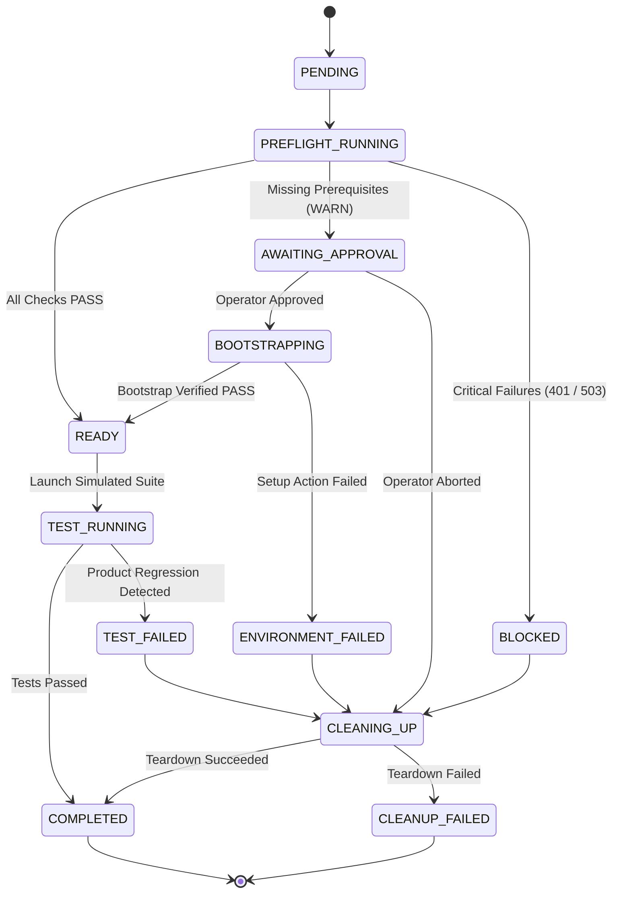

# Environment Readiness Orchestrator (Portfolio Prototype)

A deterministic, mock-only preflight and environment-readiness orchestration prototype for Cloud E2E test pipelines.

[](https://github.com/Harsh33t/Enviornment-readiness-Orchestrator-/actions/workflows/ci.yml)
[](LICENSE)

---

## 🎯 The Problem

In modern end-to-end testing, tests often fail not due to genuine product bugs, but because the test environment was unready:
- Authentication tokens expired (401)
- Downstream microservices degraded or offline (503)
- Required seed database entities missing (404)
- Ephemeral test entities leaked across test executions

This prototype implements an **Environment Readiness Layer** that runs preflight checks, requests operator approval for bootstrap setup, executes isolated mock tests, and enforces idempotent resource cleanup.

---

## 🔒 Safety & Prototype Isolation Boundary

- **In-Memory Mock Engines:** 100% deterministic local handlers; no live external network requests.
- **SSRF Protections:** Strict URL parsing and allowlisted local mock endpoints.
- **Zero Real Credentials:** Synthetic mock tokens only; payloads sanitized without prefix leakage.
- **No Arbitrary Execution:** Disallows shell execution and dynamic code evaluation.
- **Simulated Test Layer:** Standalone prototype for evaluation; not integrated into production Zorro or Narrative infrastructure.

---

## ⚙️ Lifecycle State Machine



---

## 🚀 Getting Started

### Prerequisites
- Node.js >= 20.0.0
- npm >= 10.0.0

### Installation & Run

```bash
# 1. Install dependencies
npm ci

# 2. Run typecheck & linter
npm run lint

# 3. Run automated tests (47 unit & integration tests)
npm test

# 4. Start local interactive dashboard
npm start
# -> Open http://localhost:3000
```

---

## 📁 Project Architecture & Documentation

- [`PRODUCT_SCOPE.md`](./PRODUCT_SCOPE.md): Target users, MVP boundaries, non-goals, and open questions.
- [`LIMITATIONS.md`](./LIMITATIONS.md): Strict architectural boundaries and non-production disclaimer.
- [`SECURITY_REVIEW.md`](./SECURITY_REVIEW.md): Threat matrix, SSRF protection, credential sanitization, and safety bounds.
- [`MOCK_SERVICE.md`](./MOCK_SERVICE.md): Deterministic mock endpoints, fixtures, and scenario definitions.
- [`DEMO_GUIDE.md`](./DEMO_GUIDE.md): 5-minute technical demonstration script.
- [`FINAL_REVIEW.md`](./FINAL_REVIEW.md): Senior code review, test audit, and outreach questions.
- [`PROJECT_SUMMARY.md`](./PROJECT_SUMMARY.md): Complete technical build and architecture document.

---

## 🧪 Comparison: Public Zorro Primitives vs. Prototype Layer

| Documented Zorro Public Concepts | This Readiness Prototype Layer |
| :--- | :--- |
| **Agent / Workflow Execution** | **Preflight Gatekeeper:** Verifies health, auth, and seed data *before* running test tasks. |
| **Environment Provisioning** | **Run-Scoped Resource Ledger:** Idempotent tracking and cleanup of all provisioned mock test entities. |
| **Failure Triage** | **Precedence Classifier:** Distinguishes `ENVIRONMENT_FAILED` / `BLOCKED` from true `TEST_FAILED` (product regression). |
| **Operator Observability** | **Remediation Dashboard:** Real-time preflight matrix, state transition timeline, and approval flow. |
